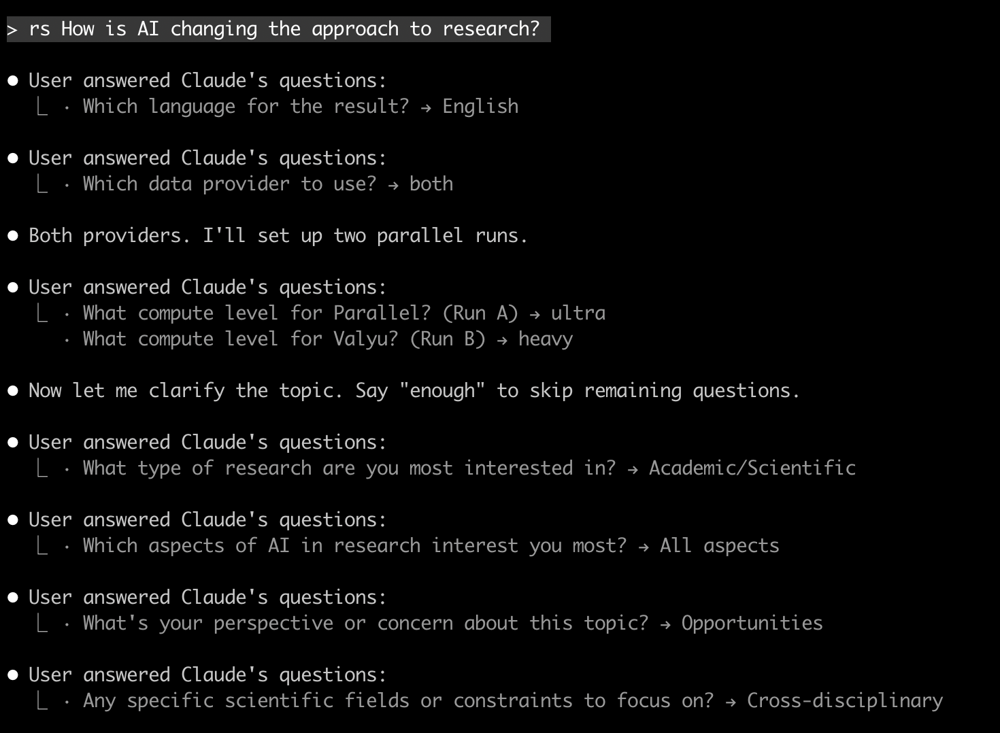

# (defn research [ ])

An experiment in agent-first software.

## What is this?

AI agents let you build serious tools just for yourself — iterate daily, adapt as you go. This is that kind of project. A deep research tool for personal use.

Beyond that, the same agent can be part of the interface itself. You describe what you want, it asks clarifying questions, then handles execution. Follow-up dialogue isn't a bug — it's how the agent learns what you actually need before acting.

## How it works

1. **You describe the task** — in natural language, to your AI agent
2. **Agent asks follow-ups** — clarifying questions are part of the design, not a bug
3. **Agent runs the research** — handles Docker and parameters
4. **You get a PDF report** — Hokusai-inspired aesthetic, pleasant to read

The follow-up dialogue is intentional. The agent learns what you actually need before executing — language, depth level, specific angles to explore.

<p align="center">
  
</p>

**Tip:** Use plan mode for the best experience. Follow-up questions appear as selectors, making choices easier.

## Quick Start

**This is not a CLI tool.** You don't run commands directly in your terminal. Instead:

1. Open this project folder in an AI coding agent (Claude Code, Codex, Cursor, Junie, etc.)
2. Talk to the agent using the DSL commands below
3. The agent handles Docker, APIs, and file generation for you

```
# In your AI agent, just type:
rs quantum computing applications

# The agent will:
# - Ask clarifying questions (language, depth, focus)
# - Build and run Docker containers
# - Generate a PDF report in ./output/
```

The agent reads `CLAUDE.md` for instructions. You focus on what you want to research — the agent handles how.

### Examples

Both engines researching "AI transformation of academic research":
- [Parallel example](./examples/parallel-ai-academic-research.pdf) — 21 pages, strategic focus
- [Valyu example](./examples/valyu-ai-academic-research.pdf) — 25 pages, data-rich

## Agent adaptability

If something breaks (environment issues, missing dependencies, config problems), the agent can fix it. You don't need to understand the infrastructure details — that's the agent's job.

## DSL

Check `CLAUDE.md` for the agent's instruction set. It's simple — a few commands like:
- `rs <topic>` for new research
- `frk` for forking existing research (re-brief or deep-dive)
- `st` for status
- `pdf <topic>` for regeneration if needed. 
The agent will understand what to do even with incomplete or vague inputs.

When you run `rs <topic>`, the agent walks you through the entire flow — asks about language, depth, refines the topic with you. At the end, you get a ready PDF in the output folder.

## Testing

Run tests in Docker:

```bash
docker build -t research-test -f Dockerfile.test .
docker run --rm research-test :unit
docker run --rm -v "$PWD/tmp_cache:/app/tmp_cache" research-test :integration
```

For agents: use `tst` command.

Local run:

```bash
lein run
```

Local tests:

```bash
lein test :unit
lein test :integration
```

Pre-commit runs unit tests:

```bash
pre-commit run --all-files
```

## Requirements

- Java 17+
- Leiningen
- Docker
- An AI coding agent (Claude Code, Codex, Cursor, Junie, etc.)

## Envs

- `PARALLEL_API_KEY`: Parallel AI API access for research runs
- `VALYU_API_KEY`: Valyu API access for research runs
- `GEMINI_API_KEY` (optional): Gemini API access for cover image generation, empty means no image
- `REPORT_FOR` (optional): name inserted into report attribution line, empty means no name

## Providers

Two deep research engines are available:

| Aspect | Parallel | Valyu |
|--------|----------|-------|
| **Sources** | Open internet | Open internet + Academic & proprietary sources |
| **Strength** | Strategic synthesis, executive summaries | Data-rich analysis, better citations |
| **Best for** | Business decisions, implementation planning | Academic research, evidence gathering |
| **Processors** | pro, ultra, ultra2x, ultra4x, ultra8x | fast, standard, heavy |
| **Speed** | 10-40 min | 30-90 min |
| **Price** | Affordable | Higher (~3-4x) |

You can also pass `--provider all` to run both providers sequentially in
the same session folder.

### When to choose

- **Parallel**: You need actionable recommendations, broad internet coverage, or faster turnaround
- **Valyu**: You need academic sources, proper citations, or comprehensive data analysis

## License

Apache 2.0
